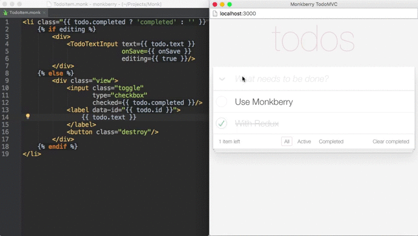
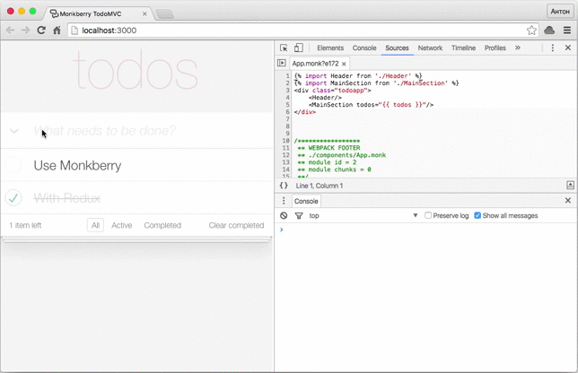

# TodoMVC — Redux with Monkberry

Original example with Redux + React = 91.67 kB (minified & gzipped), **Redux + Monkberry = 10.77 kB** (minified & gzipped).

```
npm start
```


## Hot module replacement 



## Source maps

